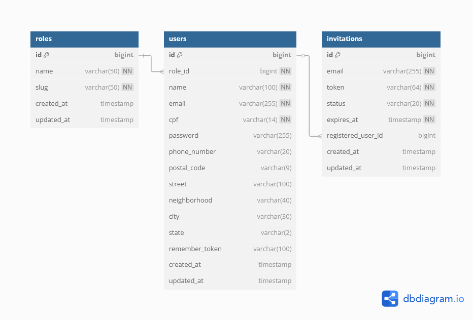

# Plataforma de Onboarding - TechnologySolutions


## 📖 Sobre a API

Este repositório contém o backend (API RESTful) para a plataforma de onboarding da TechnologySolutions. Desenvolvido em **Laravel 12**, ele é responsável por toda a lógica de negócios, segurança, gerenciamento de dados e comunicação com o banco de dados.

O ambiente de desenvolvimento é totalmente conteinerizado com **Docker** e **Laravel Sail** para garantir consistência e facilidade de configuração.

> **O repositório do Frontend (Angular) pode ser encontrado aqui:** [Link para o Repositório do Frontend](https://github.com/Kaeffea/techsol-frontend)

## ✨ Funcionalidades

-   ✅ **Autenticação Segura:** Sistema de login baseado em token com Laravel Sanctum.
-   ✅ **Fluxo de Convites:** Endpoints para criar convites seguros com token e tempo de expiração.
-   ✅ **Sistema de Perfis (Roles):** Gerenciamento de perfis (Admin, Gente e Cultura, Colaborador).
-   ✅ **Registro de Usuário:** Endpoint para finalizar o cadastro a partir de um convite válido.
-   ✅ **Gestão de Colaboradores (CRUD):** Endpoints para Listar, Buscar, Visualizar e Atualizar colaboradores.
-   ✅ **Exportação de Dados:** Funcionalidade para exportar a lista de colaboradores (respeitando os filtros) para um arquivo **Excel (.xlsx)**.
-   ✅ **Documentação de API:** Geração de documentação interativa e profissional com **Swagger (OpenAPI)**.

## 🛠️ Tecnologias Utilizadas

-   **Framework:** Laravel 12
-   **Linguagem:** PHP 8.4
-   **Banco de Dados:** MySQL
-   **Ambiente:** Docker, Laravel Sail, WSL2
-   **Dependências Chave:** `maatwebsite/excel`, `darkaonline/l5-swagger`

## ⚙️ Pré-requisitos

-   [Git](https://git-scm.com/)
-   [Docker Desktop](https://www.docker.com/products/docker-desktop/)
-   [WSL2](https://learn.microsoft.com/pt-br/windows/wsl/install) (para usuários de Windows)
-   [Composer](https://getcomposer.org/)

## 🚀 Como Executar a API

```bash
# 1. Clone este repositório
git clone https://github.com/Kaeffea/techsol-api
cd techsol-api

# 2. Copie o arquivo de ambiente
cp .env.example .env

# 3. Instale as dependências do PHP com Composer
# (O Sail iniciará os contêineres para executar o comando)
./vendor/bin/sail composer install

# 4. Gere a chave da aplicação
./vendor/bin/sail artisan key:generate

# 5. Inicie os contêineres Docker em background
./vendor/bin/sail up -d

# 6. Rode as migrations e os seeders para criar e popular o banco
./vendor/bin/sail artisan migrate:fresh --seed

# 7. A API estará pronta para receber requisições!
# URL Base: http://localhost:8888
```

## 📄 Documentação da API (Swagger)

A documentação completa e interativa da API pode ser acessada no seguinte endereço após iniciar o ambiente:

[http://localhost:8888/api/documentation](http://localhost:8888/api/documentation)

## 📊 Diagrama do Banco de Dados


